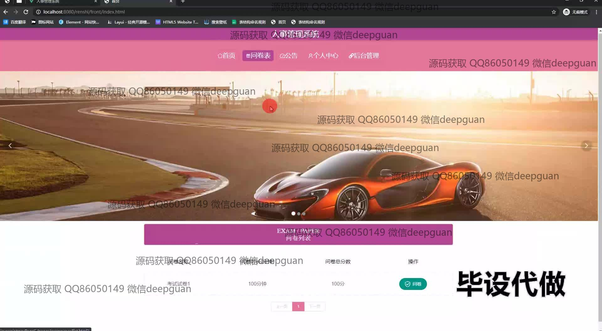
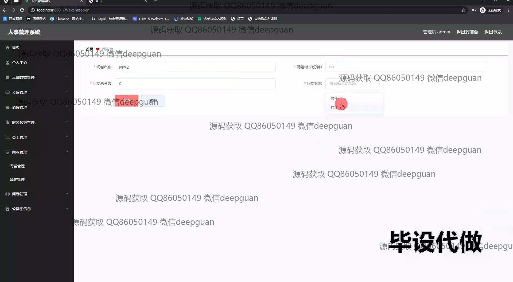

<h1 align="center">人事管理系统</h1>

## 简介
人事管理系统：角色分为管理员、普通用户；功能包括员工信息管理、考勤记录、薪资管理、绩效评估、考试与问卷管理、财务报销管理和公告管理，系统操作简便，适用于提升企业人力资源管理效率。    --计算机毕业设计源码；毕设源码；java毕业设计源码

## 联系方式

<h3 align="center">获取完整代码与数据库文件 + 微信：deepguan QQ: 86050149 QQ群: 783742310</h3>

<h3 align="center">可帮忙远程部署 包运行成功！提供远程部署、修改代码、设计文档指导、代码讲解等服务！</h3>

## 功能介绍（完整见运行截图）
管理员： 负责管理员工信息和系统设置，主要功能包括员工信息管理，考勤记录，薪资管理，绩效评估，考试与问卷管理，招聘管理等模块。可以添加、修改、删除员工信息，生成报表，管理考试试题，配置问卷以及查看各类统计数据。支持数据统计和报表生成功能，以提高管理决策的科学性，并通过用户权限管理控制不同人员的操作范围。

员工： 可通过系统查看和更新个人信息，进行日常考勤和查看薪资明细，参与系统安排的在线考试和问卷调查。员工能在“个人中心”查看自己的历史数据，包括考勤记录和绩效评估结果，提交和管理请假申请，及参与招聘信息的反馈。能通过富文本编辑器输入请假原因和报销说明，提供上传文件功能以支持报销申请。

考勤员： 管理与监控员工的日常出勤情况，查看缺勤和迟到记录，并进行相关数据分析。可生成详细的考勤报告以供管理者参阅，确保员工考勤记录的准确性和有效性。具备考勤数据的数据过滤、分类和整理功能，可以高效管理大批量数据，并协助进行人力资源规划和决策支持。

财务人员： 负责企业的薪酬和财务报销管理，录入和审核各类财务报表，维护和管理员工的薪资计算和报销申请。提供详细的工资和报销管理模块，包含报账编号、内容录入、费用说明编辑及凭证上传功能。帮助确保企业财务数据的准确性和透明度，并能生成财务分析报告，以支持企业财务和预算决策。

## 运行截图

本代码来源于网络,仅供学习参考使用!

